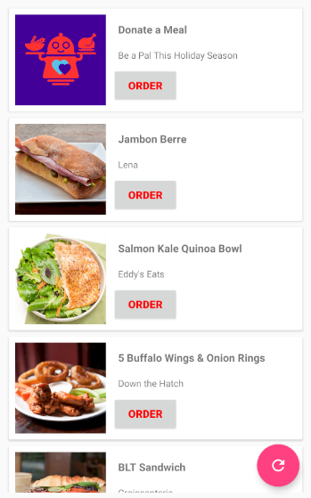

How to use and test application:
1) Verify that you have the internet connection for the first launch
2) Open the application
3) Click on 'ORDER' buttons a few times as you wish
4) Press Fab button
5) Repeat step #3 and verify that everything is work as expected. 

# LiveData/Room/Retrofit2/Dagger2/RxJava2/Kotlin

Languages, libraries and tools used

- [Kotlin](https://kotlinlang.org/)
- [RxJava](https://github.com/ReactiveX/RxJava) and [RxAndroid](https://github.com/ReactiveX/RxAndroid) 
- Dependency Injection with Dagger 2
- [Room](https://developer.android.com/topic/libraries/architecture/room.html) Persistence Library
- Network communication with [Retrofit 2](http://square.github.io/retrofit/)
- [Stetho](http://facebook.github.io/stetho/) as debug bridge
- Image loading and caching with [Glide](https://github.com/bumptech/glide)
- [Timber](https://github.com/JakeWharton/timber)
- [DexOpener](https://github.com/tmurakami/dexopener)
- [Detekt](https://arturbosch.github.io/detekt/) Static Code Analyzer
- [Moshi](https://github.com/square/moshi) JSON Serialization

## Architecture

This project follows Android architecture guidelines that are based on MVVM.
